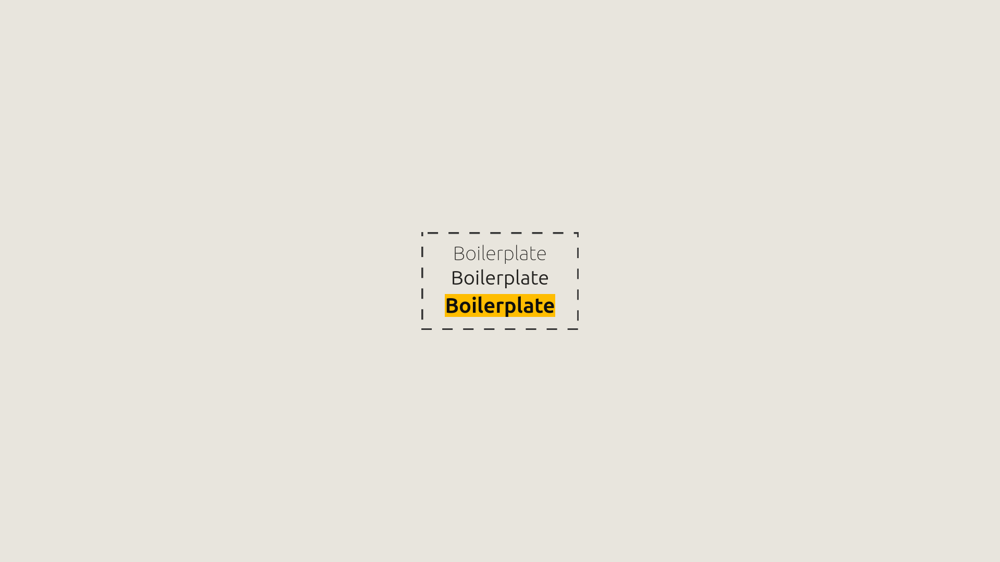

<h1 align="center">
NodeJs Boilerplate With Express And Its Body Parser Axios Jest Eslint Prettier EditorConfig Configured
</h1>

 

 

  <a href="#description">Description</a> &nbsp;&nbsp;&nbsp;|&nbsp;&nbsp;&nbsp <a href="#install">Install</a> &nbsp;&nbsp;&nbsp;|&nbsp;&nbsp;&nbsp <a href="#technologies">Technologies</a> &nbsp;&nbsp;&nbsp;|&nbsp;&nbsp;&nbsp <a href="#related">Related</a> &nbsp;&nbsp;&nbsp;|&nbsp;&nbsp;&nbsp <a href="#references">References</a> &nbsp;&nbsp;&nbsp;|&nbsp;&nbsp;&nbsp <a href="#contact">Contact</a>

 
 

<h3 id="description">✍️ Description:</h3>

Some times I need a quick project start up. To make this real I decided to create a fast Node Js Boilerplate to just programme, when this is all you want.

 

<h3 id="install">🔍  Install:</h3>

To create this Boilerplate, I used NPM.If you are using Yarn, I recommend to migrate this dependencies.

**To Install The Package:**

`npm install`

**To Start Development Script:**

`npm run start`

**To Run The Tests:**

`npm run test`

 

<h3 id="technologies">🚀  Technologies:</h3>

To build this project is used:

- Javascript
- NPM
- Node
- EditorConfig
- Eslint
- Prettier
- Jest Js
- Express
- Express Body Parser
- Express Public Directory

 

<h3 id="related">♟️  Related:</h3>

See more:

<ul>
  <li><a href="https://github.com/samuelcarvalhodeveloper/Google-Clone-w-React-Js-Typescript-Styled-Components-Prettier-Eslint-EditorConfig">Google Clone</a></li>
  <li><a href="https://github.com/samuelcarvalhodeveloper/Pinterest-Clone-w-React-Js-Typescript-Styled-Components-Prettier-Eslint-EditorConfig">Pinterest Clone</a></li>
  <li><a href="https://github.com/samuelcarvalhodeveloper/Starbucks-Clone-w-React-Js-Typescript-Context-Api-Styled-Components-Prettier-Eslint-EditorConfig">Starbucks Clone</a></li>
  <li><a href="https://github.com/samuelcarvalhodeveloper/Facebook-Clone-w-React-Js-Typescript-Styled-Components-Prettier-Eslint-EditorConfig">Facebook Clone</a></li>
  <li><a href="https://github.com/samuelcarvalhodeveloper/Calculator-w-React-Js-Redux-ToolKit-Typescript-Styled-Components-Prettier-Eslint-EditorConfig">Calculator w/ Redux</a></li>
</ul>

 

<h3 id="contact">✉️  Contact:</h3>

**Email:**
<a href="mailto:personal.samuelcarvalho@gmail.com">personal.samuelcarvalho@gmail.com</a>

 
 

<strong>Repository Link:</strong>

[https://github.com/samuelcarvalhodeveloper/NodeJs-Boilerplate-w-Express-And-Its-Body-Parser-Axios-Jest-Eslint-Prettier-EditorConfig-Configured](https://github.com/samuelcarvalhodeveloper/NodeJs-Boilerplate-w-Express-And-Its-Body-Parser-Axios-Jest-Eslint-Prettier-EditorConfig-Configured)
